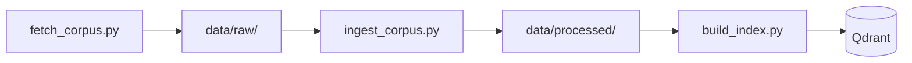

# Ragulation

A retrieval-augmented generation assistant that answers questions over the
EU AI Act, GDPR, and related regulatory guidance, in English and French,
with a RAGAS-based evaluation pipeline that gates merges on measured
faithfulness and relevancy.


## Status

Foundations and ingestion stage complete: corpus acquisition, Docling-based
ingestion, three chunking strategies, an Ollama `bge-m3` embedding client,
Qdrant hybrid indexing, and a 62-pair golden QA dataset. Verified end to
end locally (fetch, ingest, chunk, index, query): 65 tests passing
(57 unit, 8 integration), 89% unit test coverage, clean `pip-audit` and
`gitleaks`. No CI badge yet: workflows are written and locally verified
but have not run on GitHub Actions yet.

## The problem it solves

Answering questions against EU AI Act and GDPR text, plus the guidance that
interprets it, by hand means cross-referencing dozens of articles, recitals,
and separately published guidelines. This project builds a Q&A assistant
that retrieves the relevant passages, cites them explicitly, and refuses to
answer when the retrieved context is insufficient, with its accuracy
measured rather than assumed.

## Quick start

```bash
git clone <repository-url>
cd ragulation
uv sync
docker compose up -d
ollama serve &
ollama pull bge-m3
uv run python scripts/build_index.py --strategy recursive
```

The corpus is already committed (`data/raw/`, `data/processed/`), so a
clean clone can index directly. To reproduce the fetch and parsing steps
from scratch instead:

```bash
uv run python scripts/fetch_corpus.py
uv run python scripts/ingest_corpus.py
```

Verify it worked with a manual hybrid query:

```bash
uv run python - <<'PY'
from rag_flagship.embeddings.dense import build_dense_embedding_model
from rag_flagship.indexing.store import build_vector_store
from rag_flagship.indexing.pipeline import hybrid_query

embed_model = build_dense_embedding_model()
vector_store = build_vector_store("rag_flagship_recursive")
for r in hybrid_query(vector_store, embed_model, "What is the maximum fine for a GDPR infringement?", top_k=3):
    print(round(r.score, 3), r.node.metadata["doc_id"], r.node.metadata["locator"])
PY
```

## Key features

- Bilingual EU regulatory corpus (AI Act + GDPR official text in English
  and French, plus 12 curated EDPB/Commission/GPAI Code of Practice
  guidance documents, English) sourced directly from EUR-Lex and the
  Publications Office's Cellar repository.
- Docling-based ingestion recovering legal structure (articles, recitals,
  chapters, guidance sections) as individually citable passages.
- Three chunking strategies (recursive, semantic, parent-child)
  implemented behind one common interface, ready for a later comparative
  evaluation stage.
- Hybrid retrieval: dense `bge-m3` embeddings plus BM25, fused with
  Reciprocal Rank Fusion, served from a local Qdrant instance.
- A 62-pair hand-curated golden question set (factual, multi-hop,
  out-of-corpus traps, and a cross-lingual subset), each fact-checked
  against the real corpus while authoring.

## Architecture

Three sequential CLI scripts, each writing its output to disk for the next
to read, backed by a local Ollama server and a local Qdrant Docker
container:



`src/rag_flagship/` is organized as one package per pipeline stage
(`corpus`, `ingestion`, `chunking`, `embeddings`, `indexing`, `golden`),
each with its own tests under `tests/unit/` and `tests/integration/`.

## Usage

```bash
uv run python scripts/build_index.py --strategy {recursive,semantic,parent_child}
uv run pytest -q                    # unit tests, fast, no network or live models
uv run pytest -q -m integration     # integration tests, needs Ollama and Qdrant running
```

## Configuration

Every setting is typed and environment-driven (pydantic-settings). Copy
`.env.example` to `.env` and adjust:

| Variable | Default | Effect |
|---|---|---|
| `OLLAMA_BASE_URL` | `http://localhost:11434` | Ollama server URL |
| `OLLAMA_DENSE_MODEL_NAME` | `bge-m3` | Dense embedding model |
| `QDRANT_URL` | `http://localhost:6333` | Qdrant instance URL |
| `QDRANT_API_KEY` | empty | Qdrant API key, if required |
| `MISTRAL_API_KEY` | empty | Reserved for the generation stage, unused so far |

## Key decisions

Fully open-source and local stack, chosen to run entirely on the
developer's own machine: Docling for parsing, LlamaIndex for chunking and
vector store orchestration, Ollama `bge-m3` for dense embeddings, BM25
(`fastembed`) for the sparse side of hybrid retrieval, and Qdrant
(self-hosted via Docker) for storage and Reciprocal Rank Fusion. Data is
tracked directly in Git rather than with a data-versioning tool, since the
corpus is small enough not to need one.

## Security

See `SECURITY.md` for how to report a vulnerability. Retrieved and
generated content is treated as untrusted data throughout the pipeline.

## Contributing

See `CONTRIBUTING.md`.

## License

Apache License 2.0, see `LICENSE`.
