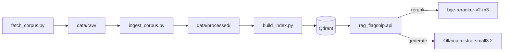

# Ragulation

A retrieval-augmented generation assistant that answers questions over the
EU AI Act, GDPR, and related regulatory guidance, in English and French,
with a RAGAS-based evaluation pipeline that gates merges on measured
faithfulness and relevancy.


## Status

Foundations, ingestion, retrieval tuning, and generation complete: corpus
acquisition, Docling-based ingestion, three chunking strategies, an Ollama
`bge-m3` embedding client, Qdrant hybrid indexing, a cross-encoder
reranker, Mistral generation with citations and refusal, a FastAPI
service, and a 62-pair golden QA dataset. Verified end to end locally
(fetch, ingest, chunk, index, query, rerank, generate, serve): 95 tests
passing (80 unit, 15 integration), 90% unit test coverage, clean
`pip-audit` and `gitleaks`. No CI badge yet: workflows are written and
locally verified but have not run on GitHub Actions yet.

## The problem it solves

Answering questions against EU AI Act and GDPR text, plus the guidance that
interprets it, by hand means cross-referencing dozens of articles, recitals,
and separately published guidelines. This project builds a Q&A assistant
that retrieves the relevant passages, cites them explicitly, and refuses to
answer when the retrieved context is insufficient, with its accuracy
measured rather than assumed.

## Quick start

```bash
git clone <repository-url>
cd ragulation
uv sync
docker compose up -d
ollama serve &
ollama pull bge-m3
ollama pull mistral-small3.2
uv run python scripts/build_index.py --strategy recursive
```

The corpus is already committed (`data/raw/`, `data/processed/`), so a
clean clone can index directly. To reproduce the fetch and parsing steps
from scratch instead:

```bash
uv run python scripts/fetch_corpus.py
uv run python scripts/ingest_corpus.py
```

Then run the API and ask a question:

```bash
uv run uvicorn rag_flagship.api.app:app --reload
curl -X POST localhost:8000/query \
  -H 'Content-Type: application/json' \
  -d '{"question": "What are the conditions for consent under GDPR?", "language": "en"}'
```

A response looks like:

```json
{
  "answer": "...",
  "sources": [{"doc_id": "gdpr_en", "locator": "Article 7 - Conditions for consent", "score": 0.98}],
  "refused": false
}
```

Questions with no basis in the corpus (for example, about traffic law)
return `"refused": true` instead of a fabricated answer.

## Key features

- Bilingual EU regulatory corpus (AI Act + GDPR official text in English
  and French, plus 12 curated EDPB/Commission/GPAI Code of Practice
  guidance documents, English) sourced directly from EUR-Lex and the
  Publications Office's Cellar repository.
- Docling-based ingestion recovering legal structure (articles, recitals,
  chapters, guidance sections) as individually citable passages.
- Three chunking strategies (recursive, semantic, parent-child)
  implemented behind one common interface, ready for a later comparative
  evaluation stage.
- Hybrid retrieval: dense `bge-m3` embeddings plus BM25, fused with
  Reciprocal Rank Fusion, served from a local Qdrant instance.
- Cross-encoder reranking (`BAAI/bge-reranker-v2-m3`) over the hybrid
  retrieval candidates before generation.
- Mistral (`mistral-small3.2` via Ollama) generation with a
  citation-and-refusal prompt: a two-layer refusal design (a fast,
  deterministic reranker-score threshold plus the model's own instructed
  fallback) and structural, independently-verifiable citations returned
  alongside every answer.
- A FastAPI service (`GET /health`, `POST /query`, `POST /ingest`) built
  on top of the same pipeline, with heavy dependencies (embedding model,
  reranker, LLM, vector store client) constructed once at startup.
- A 62-pair hand-curated golden question set (factual, multi-hop,
  out-of-corpus traps, and a cross-lingual subset), each fact-checked
  against the real corpus while authoring, and used to calibrate the
  refusal threshold against measured reranker scores.

## Architecture

Three sequential CLI scripts build the index, then a FastAPI service
answers questions against it, backed by a local Ollama server and a local
Qdrant Docker container:



`src/rag_flagship/` is organized as one package per pipeline stage
(`corpus`, `ingestion`, `chunking`, `embeddings`, `indexing`, `reranking`,
`generation`, `api`, `golden`), each with its own tests under
`tests/unit/` and `tests/integration/`.

## Usage

```bash
uv run python scripts/build_index.py --strategy {recursive,semantic,parent_child}
uv run python scripts/calibrate_refusal_threshold.py
uv run uvicorn rag_flagship.api.app:app --reload
uv run pytest -q                    # unit tests, fast, no network or live models
uv run pytest -q -m integration     # integration tests, needs Ollama and Qdrant running
```

## Configuration

Every setting is typed and environment-driven (pydantic-settings). Copy
`.env.example` to `.env` and adjust:

| Variable | Default | Effect |
|---|---|---|
| `OLLAMA_BASE_URL` | `http://localhost:11434` | Ollama server URL |
| `OLLAMA_DENSE_MODEL_NAME` | `bge-m3` | Dense embedding model |
| `OLLAMA_GENERATION_MODEL_NAME` | `mistral-small3.2` | Generation model |
| `QDRANT_URL` | `http://localhost:6333` | Qdrant instance URL |
| `QDRANT_API_KEY` | empty | Qdrant API key, if required |
| `RERANKER_MODEL_NAME` | `BAAI/bge-reranker-v2-m3` | Cross-encoder reranker model |
| `RERANKER_DEVICE` | `cpu` | Hardcoded, not auto-detected: GPU inference silently produced wrong scores under memory contention with Ollama on this machine |

## Key decisions

Fully open-source and local stack, chosen to run entirely on the
developer's own machine: Docling for parsing, LlamaIndex for chunking and
vector store orchestration, Ollama `bge-m3` for dense embeddings, BM25
(`fastembed`) for the sparse side of hybrid retrieval, Qdrant (self-hosted
via Docker) for storage and Reciprocal Rank Fusion, `sentence-transformers`
for cross-encoder reranking, and Ollama `mistral-small3.2` for generation.
Data is tracked directly in Git rather than with a data-versioning tool,
since the corpus is small enough not to need one. Citations are returned
as a structural, typed field on every response rather than left to the
model's own inline prose, since the latter is not reliably accurate.

## Security

See `SECURITY.md` for how to report a vulnerability. Retrieved and
generated content is treated as untrusted data throughout the pipeline.

## Contributing

See `CONTRIBUTING.md`.

## License

Apache License 2.0, see `LICENSE`.
